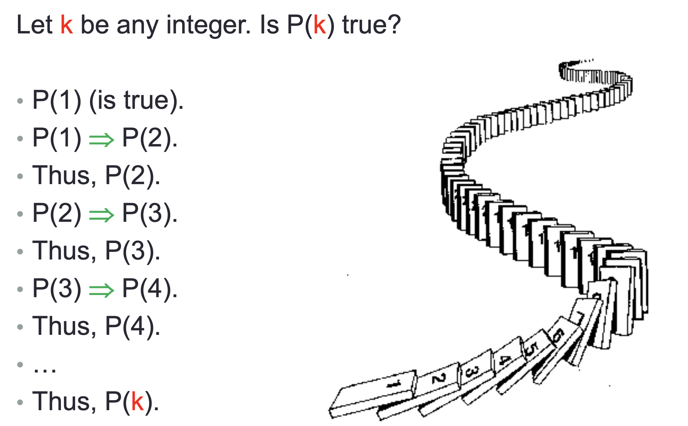
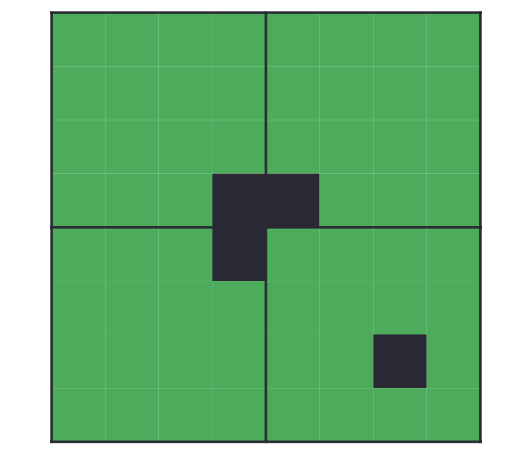

# Unit 2 -- Methods of Prove

## 1. Puzzle: Halting problem
**Is it possible to write a function H that:**<br>
* **takes two inputs (arguments): a function (binary string) P and an input (binary string) x;**
* **and reports “loop forever” if P loops forever with input x, and “halt” if P halts eventually ?**

### Baber Paradox
**Before we try to solve this puzzle, let's see this [Baber Paradox](https://en.wikipedia.org/wiki/Barber_paradox):**<br>

**The barber is the "one who shaves all those, and those only, who do not shave themselves".<br>The question is, does the barber shave himself?**<br>
**The baber's rule seems to make sense.<br>Since someone cuts their own hair, then the baber don't need to cut this person again.**<br>
**At first, there was nothing wrong with this rule. Later, as the barber's own hair grew longer and longer, he found that he was in a dilemma: Should he give himself a haircut?**

* **If he does, he cannot be a barber, since a barber does not shave himself.**
* **If he doesn't, he falls in the category of those who do not shave themselves, and so, cannot be a barber.**

**Combining the above two situations, "he cuts a hair for himself" if and only if "he does not cut a hair for himself", this becomes a paradox.**

### The Halting problem
**Back to our question:<br>**
**When we write code for debugging, we sometimes meet such a situation:<br>After waiting for a long time, the program is still running. We don’t know if the code is running normally but it takes a long time to run, or the code is written with problems (such as writing The program will not stop at all. At this time, if there is a tool that can judge the running time of the code we write for us, it would be great. This is the [Halting problem](https://en.wikipedia.org/wiki/Halting_problem)**

### Solving
**Let's assuming that this test code is a function:**
```c
void f(char *t)
```
**The t is an argument, which can be any thing(char int or even blank)**<br>
**Suppose there is such a function that can be used to determine the halt problem**<br>
```c
bool halts(char *f_code, char *t);
```
**Where ```f_code``` is the ASCII source code of the function ```f()``` we want to test, we can think that the function ```f()``` is obtained by compiling ```f_code```. <br>When ```f()``` is stopped for t, ```halts(f_code, t)``` returns true; when ```f()``` does not stop for t, ```halts(f_code, t)``` returns false.**
<br>

**Let's build another function:<br>**
```c
void modified_halts(char *f_code) {
  if (halts(f_code, f_code)) {  // When halts(f_code, f_code) return true
    while (true) { /*empty*/ }  // keep cycling
  }
  else {                        // When halts(f_code, f_code) return false
    return;                     // stopped!
  }
}
```

**The function ```modified_halts()``` is like the baber. it only halts those functions that don't halt themselves**<br>
**When the modified_halts function faces his own function code, it is like whether a barber should shave himself, it will be in a dilemma.**


### Enlightenment -- The power of computing
**With the development of electronic technology and computer technology, the storage and computing power of computers is advancing day by day. Some problems that seemed infeasible before can now be easily solved. But not when storage and computing power When it is infinite, can we solve any problem? The downtime problem gives a negative answer, --  no matter how strong the storage and computing power of the computer, the downtime problem cannot be solved.**


## 2.Mathematical Induction


<br>
**Let's see a proof:**<br>
### Theorem
**Show that any 2n x 2n chessboard with one square removed can be covered using L-shaped pieces (each occupying 3 squares) only.**

### Proof
* **Basis step, n = 1: No matter where the missing square is, the remaining three squares can be covered by one L-shaped piece.**

* **Inductive step: Assume the claim is true for some n ≥ 1. Consider a chessboard of size 2n+1 x 2n+1.**<br>

**Then divide the board into 4 quadrants, each containing 2n x 2n squares.**



**Obviously. In Bottom right corner of the diagram -- the quadrant containing the missing square can be covered using L-shaped pieces.**
<br>
**Cover the center using one L-shaped piece.**<br>
**Then apply the induction hypothesis to cover each individual quadrant using L-shaped pieces.**


