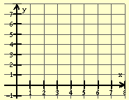
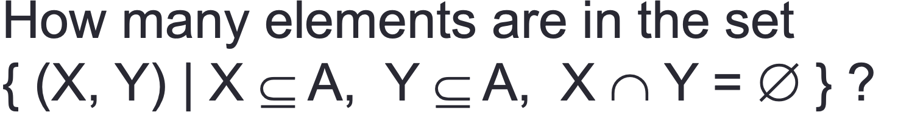

# Unit 3 -- Set Theory

## Power Sets

**The power set of a set S, denoted by P(S), is the set of all subsets of S.**

### Proof: For any set S with n elements, |P(S)| = 2^n.
**We use mathmatical induction to prove that:**

#### Base case
**When n = 1, let S = {a}. Then P(S) = {null, {a}}. **
**Thus, |P(S)| = 2 = 2^1 = 2^n.**

#### Inductive step
**Assume that if a set S’ contains k elements for some k, then |P(S’)| = 2^k.** 
**Consider the case where |S| = k + 1:** 

**Let x be an element of S and denote S’ = S - {x}.** 
**Consider each subset A of S':** 
* **A is also a subset of S.**
* **A and {x} gives another distinct subset of S.**
**Thus, S has twice as many subsets as S'.**

## Cartesian Products
**In mathematics, specifically set theory, the Cartesian product of two sets A and B, denoted A × B is the set of all ordered pairs (a, b) where a is in A and b is in B.** 

**Cartesian Product Definition for Multiplication of Whole Numbers.  Let A and B be two finite sets with a = n(A) and b = n(B). Then ab = n(A * B).  The numbers a and b are called factors and ab is the product.** 
**n(A) * n(B) -> n(A * B)** 

**Example:  In algebra the rectangular or Cartesian coordinate plane is an example of the Cartesian product. We consider the set of all the ordered pairs describing locations in the plane.**

 
### Question
**Assume that set A contains n element **

**Answer: 3^n**

#### Explaination
**In this Question, we can see that -> X and Y is a subset of A. Which means both X and Y are sets** 
**Then, for every elements in A. There are three choices:**
* **in X**
* **in Y**
* **not in Both X and Y**
**So there are 3 different choices for every elements. That's 3x3x...x3(n) = 3^n**

