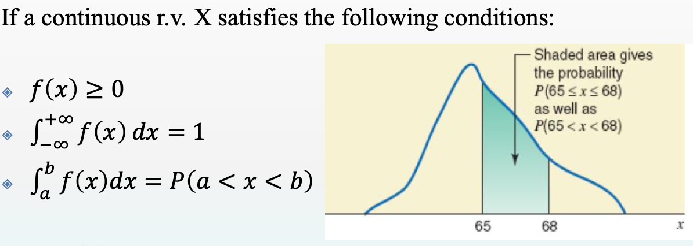

# STATS251F Notes

#### By Jiawei Wang

**[Unit2.pdf](https://github.com/Angold-4/UniversitySources/blob/master/2020Autumn/STATS251F/Lecture_Notes/Unit%202%20-%20Parameter%20Estimation.pdf)**

**<font color=red>For thouse people who cannot see fomular instead of these char below:</font><br>**
```
$$
f(x) = \frac 1{ \sqrt{2 \pi} \sigma} e^{- \frac 12 ({ \frac {x- \mu}{\sigma}})^2}
$$
```
**<font color=red>Please download this Chrome Extention: [MathJax Plugin for Github](https://chrome.google.com/webstore/detail/mathjax-plugin-for-github/ioemnmodlmafdkllaclgeombjnmnbima/related?utm_source=chrome-ntp-icon), and open this page again :-) thx!</font>**


<!-- vim-markdown-toc GFM -->

* [Unit 2 - Sampling Distribution of Means & Parameter Estimation](#unit-2---sampling-distribution-of-means--parameter-estimation)
    * [1.Random Variable](#1random-variable)
        * [Discrete Random Variable](#discrete-random-variable)
        * [Continuous Random Variable](#continuous-random-variable)
    * [2.Normal Distribution](#2normal-distribution)
        * [Standard Normal Distribution](#standard-normal-distribution)
        * [Normal Random Variable](#normal-random-variable)
    * [3.Central Limit Theorem](#3central-limit-theorem)
        * [Summary](#summary)
        * [Fig1](#fig1)
        * [Fig2](#fig2)
    * [4. Parameter Estimation](#4-parameter-estimation)
        * [Point Estimation](#point-estimation)
        * [Interval Estimation](#interval-estimation)
        * [Confidence Interval Contruction(z-distribution)](#confidence-interval-contructionz-distribution)
        * [Z - Table](#z---table)
        * [T - Table](#t---table)
        * [Degree of Freedom](#degree-of-freedom)
        * [Probability Density Function of t-distribution](#probability-density-function-of-t-distribution)
        * [Confidence Interval Contruction(t-distribution)](#confidence-interval-contructiont-distribution)

<!-- vim-markdown-toc -->

## Unit 2 - Sampling Distribution of Means & Parameter Estimation


### 1.Random Variable
**<u>A random variable (r. v.) is a variable whose value is subject to variations due to chance or randomness.</u>**
* **A r.v. is written in capital letter: X, Y, Z, etc.**
* **The value of a r.v. is written in small letter: x, y, z, etc.**
* **Notice that the r.v's value is purely by chance; we do not know the outcome beforehand**

**There are 2 types of random variables, discrete and continuous.**

#### Discrete Random Variable
**<u>A discrete random variable, X , is one which may take on only a countable number of distinct values such as 0,1,2,3,4,....</u>**

**Examples<br>**
* **Number of children in a family**
* **Attendance at a cinema**
* **Number of patients in a doctor's surgery**
* **Number of defective light bulbs in a box**

**Let the discrete r.v. X takes on n discrete values: $ x_1, x_2, ⋯ , x_n. $ <br>The probability mass function (pmf (for discrete r.v.)) is given by**

$$
p(x) = 
    \begin{cases}
        P(X=x_i), & \text{i=1,2,...n;} \\
        0, & \text{otherwise;}\\
    \end{cases}
$$

**where $P(X = x_i)$ denotes the probability when the r.v. X takes on the i-th data value $x_i$.**

#### Continuous Random Variable
**<u>A continuous random variable , X , is one which takes an infinite number of possible values. Continuous random variables are usually measurements.</u>**

**Examples:**<br>
* **Height**
* **Weight**
* **Amount of sugar in an orange**
* **Time required to run a mile**

<br>

**Then f(x) is called the probability density function (pdf (for continuous r.v.)) of X**


### 2.Normal Distribution
**The most important distribution in the entire field of statistics is the normal distribution. Its graph, called the normal curve, is the bell-shaped curve shown below. Normal distribution can describe many phenomena in nature, business, finance, medicine, biology, etc.**


* **Random variables occurring in practice often satisfy well a normal distribution.**
* **Large-sample statistics often turn out to be approximately normally distributed. This is a consequence of the central limit theorem.**
* **Most hypothesis testing that we're going to perform requires normality in some sense.**

**The probability density function of normal distribution is given by:**

$$
f(x) = \frac 1{ \sqrt{2 \pi} \sigma} e^{- \frac 12 ({ \frac {x- \mu}{\sigma}})^2}  
$$
$$
\text{where }\pi = 3.1416...  \text{   }e = 2.71828...
$$
$$
\sigma = \sqrt{\frac {\sum_{i=1}^{N}(x_i- \mu)^2}{N}}
$$
**<center>And the $\mu$ is the pop mean, which can be proof by calculate the integral of area</center>**


#### Standard Normal Distribution

**If a random variable X follows a standard normal distribution, we denote it as**<br>
**<center>X ~ $N(0 , 1)$**</center><br>
$$
\phi(x) = \frac 1 { \sqrt {2 \pi}} e ^ {-{ {\frac 12} x^2}}
$$

**Which means the Mathematical Expectation(mean) of this standard normal distribution($ \mu$) is 0.**<br>
**And the [Standard Deviation](https://en.wikipedia.org/wiki/Standard_deviation)($ \sigma$) is 1.**

<br>
**The red curve is the standard normal distribution**


#### Normal Random Variable
**If a random variable X follows a normal distribution, we use the following symbol:**<br>
**<center>X ~ $N( \mu , \sigma ^2)$**</center><br>


### 3.Central Limit Theorem

**Given any random variable $X$, discrere or continuous, with finite mean $\mu$ and finite variance, $\sigma^2$.<br>**
**Then, regardless of the sample of the population distribution of $X$, as the sample size n gets larger, the sampling distribution of sample means $(\bar{X})$ becomes increasingly closer to a normal distribution, with variance $\frac {\sigma^2}{n}$ and same mean $\mu$. That is:<br>**

$$
\bar{X} \backsim N(\mu_\bar{X}, \sigma_\bar{X}^2) = N(\mu, \frac{\sigma^2}{n}) . approximately
$$


**Finally. If $Z \backsim N(0, 1)$ (standard normal distribution):**<br>
$$
Z = \frac {\bar{X} - \mu_\bar{X}}{\sigma_\bar{X}} = \frac {\bar{X} - \mu}{\sigma / \sqrt n}
$$

<br>

* **Understand the "Z" (standard normal random variable):**

> **Suppose the average score and standard deviation of the intelligence test of a freshman in a school are 100 and 12, respectively. Therefore, if 50 students are randomly selected, what is the probability that their average score on the intelligence test is greater than 105? The probability is less than 90?**

**The central limit theorem provides a feasible solution, that is, when the random sample length exceeds 30, and the population is normally distributed, the sample average $\bar{X}$ approximates a normal variable:**

$$
\bar{X} \approx Z = \frac {\bar{X} - \mu} {\sigma / \sqrt n}
$$

**The probability that the average score is greater than 105 is: $P(Z>\frac {105-100}{12/\sqrt{50}})$ = $P(Z>2.94)$**

**Samely. The probability that the average score is less than 90 is: $P(Z<\frac {90-100}{12/\sqrt{50}})$ = $P(Z<-5.88)$**

**We can get the Value of these two probabilities by Using the Z-table which we will be metioned later.**


#### Summary

* **Sampling distribution of sample means**

**When a population is normally distributed, the sampling distribution must be normally distributed no matter how small the sample size.**

**When a population is non-normally distributed, the sampling distribution will be approximately normally distributed when the sample size tends to infinity.**

#### Fig1
**Please check this [reference](http://onlinestatbook.com/stat_sim/sampling_dist/) to test by yourself. provided by [onlinestatbook.com](www.onlinestatbook.com)**

**This is a custom random destribution, which mean is 15.33**<br>


**When it takes only 100 times sampling, and the sample size(N) is 5.<br>The Distribution of means would be like that:**


**When it takes 100000 times sampling, and the sample size(N) is 5.<br>The Distribution of means would be like that:<br>**


#### Fig2
**As the sample size, n increases, the standard deviation of sample means, $ \sigma _ x$ decreases.**


### 4. Parameter Estimation
**One of the purposes of drawing a random sample is to estimate (infer) the population parameters**

**In general, two parameter estimation methods:**<br>


| Point Estimation   | Interval Estimation |
| :------:   | :-----:  |
| Use a **single numerical value** to <br>estimate the corresponding <br>unknown population parameter. | Use an **interval** to estimate<br> the corresponding <br>unknown population parameter. |
| <u>Example</u><br>The estimated life expectancy <br>of 82 years old of all HK <br> people is a point estimate.| <u>Example</u><br>The estimated life expectancy <br>of all HK people lying within<br> (78, 85) years old is an interval estimate. |


#### Point Estimation
**Population parameters are usually unknown. We can adopt the sample statistics calculated from a sample or samples to estimate the unknown parameters**

**Let $ x_1, x_2, ... , x_n $ follow $ N(\mu, \sigma^2) $ (n = the sample size; N = the population size)**

* **Use sample mean ($ \bar{X} $) to estimate population mean ($ \mu $):**<br>
$ \bar{X} = \frac 1n \sum_{i=1}^{n} X_i \implies \mu = \frac 1N \sum_{i=1}^{N} X_i $

* **Use sample standard deviation(S) to estimate population standard deviation ($\sigma$):**<br>
$ S = \sqrt {\frac 1{n-1} \sum_{i=1}^{n} (X_i - \bar{X})^2} \implies \sigma = \sqrt {\frac 1N \sum_{i=1}^{N} (X_i - \bar{X})^2} $


#### Interval Estimation
**The limitation of Point Estimation:**
* **It is therefore difficult to evaluate the closeness of the estimate to the true value of the parameter solely relying on point estimation.**
* **we can hardly evaluate the reliability of a point estimate through the use of point estimation approach.**

**In interval estimation, we use a Confidence Interval (C.I.) to estimate the unknown population parameter, $\theta$**<br>
**If the following probabity statement holds:<br>**
$$
P\lbrace\hat{\theta_1}<\theta<\hat{\theta_2}\rbrace = 1 - \alpha
$$
**Where $\hat{\theta_1}$ and $\hat{\theta_2}$ are 2 estimators which we constructed based on our two single random samples.**<br>
**Then we say that the interval includes the true value of the unknown parameter, $\theta$ with probability 1 - $\alpha$.(0 < $\alpha$ < 1)**


* **Significance level/small probability, $\alpha$.<br>**
**The probability that the constructed confidence interval does not include the unknown parameter, $\theta$.**

* **Confidence level, 1 − $\alpha$. <br>**
**The probability that a specified interval will contain the population parameter.**

<br>


#### Confidence Interval Contruction(z-distribution)
**For an interval with (1-$\alpha$)100% confidence, its two end points on the left and right sides are $\pm z_{\alpha/2}$. The probability statement of the confidence interval for a normal population mean ($\mu$) is given by:**

<center></center>
$$
P[-z_{\alpha/2}\leq z \leq z_{\alpha/2}] = 1 - \alpha
$$

$$
P[-z_{\alpha/2}\leq \frac{\hat x - \mu}{\sigma/\sqrt n} \leq z_{\alpha/2}] = 1 - \alpha
$$

$$
P[\bar x - z_{\alpha/2} \frac {\sigma}{\sqrt n} \leq \mu \leq \bar x + z+{\alpha/2} \frac{\sigma}{\sqrt n}] = 1 - \alpha
$$

#### Z - Table


**From this table, we can find that:<br>**


| **Significance Level, $\alpha$** | **Confidence Level $1-\alpha$** | **$Z_\frac \alpha 2$** |
| :----: | :----: | :----: |
| $1\%$  | $99\%$ | $Z_{0.005} = 2.575$ |
| $5\%$  | $95\%$ | $Z_{0.025} = 1.96$ |
| $10\%$  | $90\%$ | $Z_{0.005} = 1.645$ |

<br>


#### T - Table
**When $\sigma$ is unknown and the sample size is less than 30. <br>We need to use T-distribution rather than normal distribution.**
<br>
**In other words. we need to search t value from the t-table rather than search $z$ value from the z-table**
<br>

**In practice, $\sigma$ is usually unknown. Error must be induced when $\sigma$ is replaced by s. The error will be larger for smaller sample sizes. To overcome such difficulty, we use the Student’s t-distribution rather than the normal distribution.**


#### Degree of Freedom
**Selig (1994) stated that degrees of freedom (df) are lost for each parameter in a model that is estimated in the process of estimating another parameter.**<br>

* **1 df is lost when we estimate the population mean, $\mu$ using the sample mean:<br><br>**
**Let $\lbrace x_1,x_2,...,x_n \rbrace $ be random sample.<br>**
**When we use the sample mean $\bar x = \frac 1n \sum^n_{i=1} x_i $ to estimate $\mu$ ($\hat{\mu} = \bar x$).<br>**
**Then for every random samples $\lbrace x_1, x_2, ..., x_{n_1} \rbrace$, that means we treat their sample mean $\bar x$ as $\hat{\mu}$. <br>**
**Because for every random samples, their sample mean are define as $\hat {\mu}$, we can see that for each of them (assume the sample size is $n_1$), if we gave the value of $n_1 - 1$ samples, the remaining one is definited.**<br><br>
**Without loss of generality, n samples, leaving one degree of freedom for a fixed mean, and the remaining degree of freedom is n-1.**

<br>

**After understanding the degree of freedom, we can understand the sample variance metioned earlier:<br>**
$$
S = \sqrt {\frac 1{n-1} \sum_{i=1}^{n} (X_i - \bar{X})^2} \implies \sigma = \sqrt {\frac 1N \sum_{i=1}^{N} (X_i - \mu)^2}
$$

**Because when we caculating the sample variance, the sample mean needs to be given. Considering that variance is a statistic that measures the degree of data deviation.<br>**
**Therefore, in order to calculate the sample variance, the original n degrees of freedom in the sample, one degree of freedom is assigned to calculate the sample mean, and the remaining degrees of freedom are n-1.**

#### Probability Density Function of t-distribution
**The probability density function(pdf) of the Student’s t-distribution is given by:<br>**
$$
f(x) = \frac {\tau (\frac {v+1}{2})}{\sqrt{v\pi}\tau (\frac v2)} (1 + \frac {x^2}{v})^{- \frac {v+1}{2}}
$$
**Where $\tau (s) = \int_0^{+\infty} x^{s-1}e^{-x} dx$ and $v$ is the degree of freedom of the t-distribution.**


#### Confidence Interval Contruction(t-distribution)
**If the population SD ($\sigma$) is UNKNOWN and n < 30, then the corresponding normal distribution is changed to the t-distribution.**

$$
P[-t_{\frac {\alpha}{2};k} \leq z \leq t_{\frac {\alpha}{2};k}] = 1 - \alpha
$$

$$
P[-t_{\frac {\alpha}{2};k} \leq \frac {\bar x - \mu}{s/ \sqrt{n}} \leq t_{\frac {\alpha}{2};k}] = 1 - \alpha
$$

$$
P[\bar x - t_{\alpha/2;k} \frac {s}{\sqrt n} \leq \mu \leq \bar x + t_{\alpha/2;k} \frac {s}{\sqrt n}] = 1 - \alpha
$$

<center>


**k is the degrees of freedom which equal to n-1**


