# COMPS265F Design and Analysis of Algorithms
##### By Dr. Keith Lee 2021 Spring

## Unit 1 Analysis of Algorithms
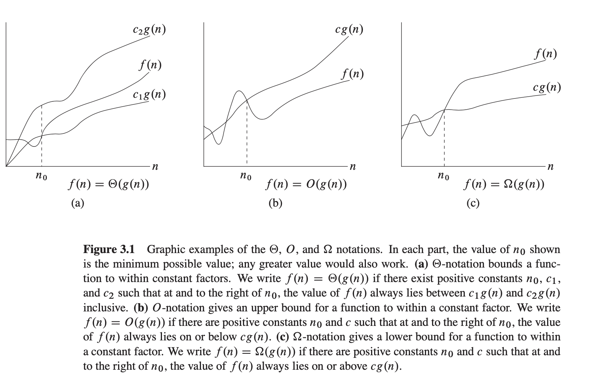

## Unit 2 Greddy Heuristics
### How to be greddy?
1. **At every step, make the best move you can make**
2. **Keep going until you done**

### Advantages
1. **Don’t need to pay much effort at each step.**
2. **Usually find a solution very quickly.**
3. **The solutions are usually not bad.**

### Example: Huffman Code
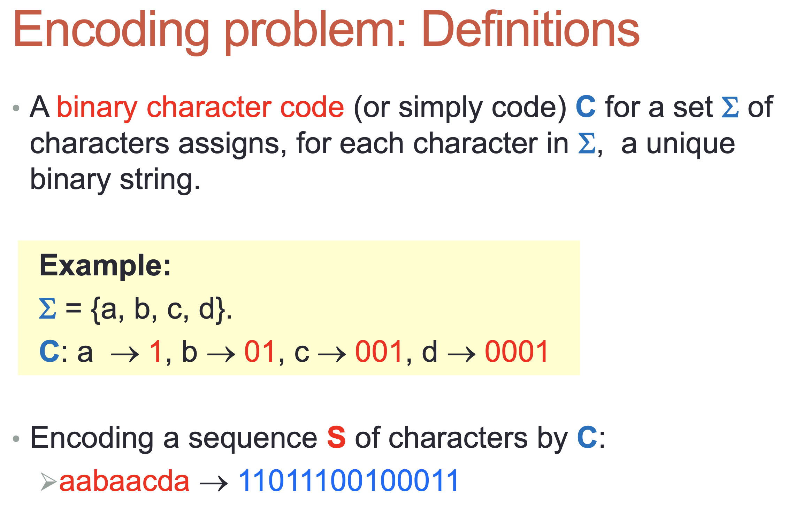
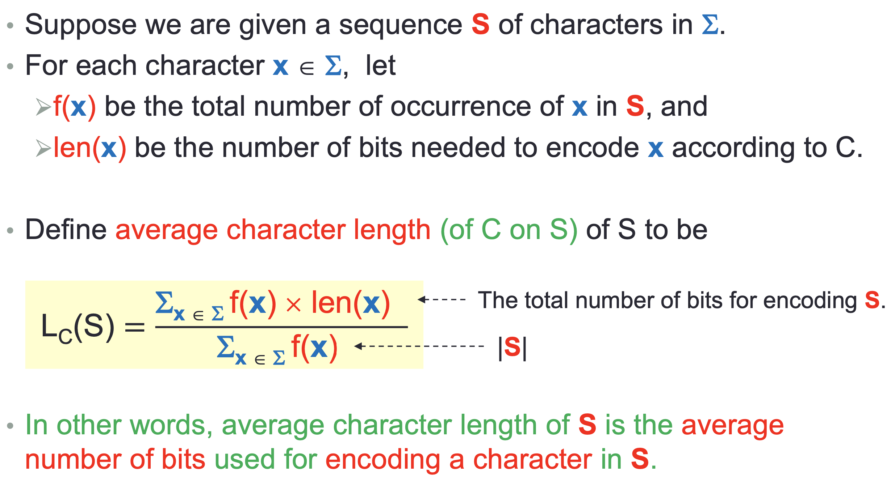
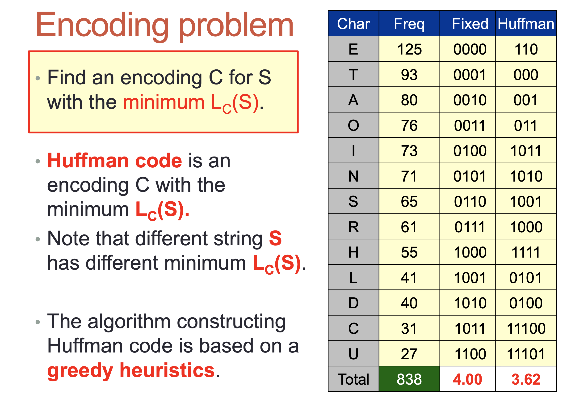
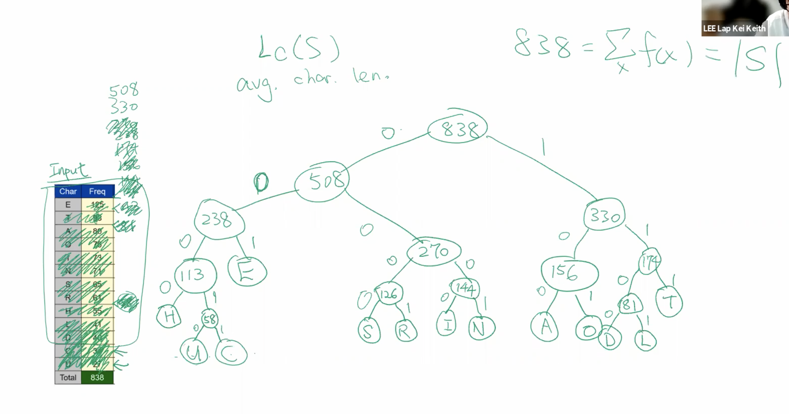

### The Code:
#### Class of Node
```python
num_node = 0;
class Node:
    def __init__(self, freq, ch, left, right):
        global num_node
        self.id = str(num_node)
        num_node += 1
        self.freq = freq
        self.ch = ch  # None for internal nodes
        self.left = left
        self.right = right
```

#### Huffman Code
```python
class Huffman:
    def __init__(self, ch_freq):
        self.h = [] # a list for (freq, node)
        self.last = None  # keep the last created Note
        self.tree = Graph()
        self.code = {}

        for ch, freq in ch_freq:
           self.last = Node(freq, ch, None, None)
           self.h.append((freq, self.last))

        # Just append it, no tree at this time(both left and right were None)

        # Construct the Huffman tree
        while len(self.h) >= 2:
            ind1 = self.h.index(min(self.h, key = lambda t: t[0])) # min freq 1
            f1, left = self.h[ind1]
            del self.h[ind1]

            ind2 = self.h.index(min(self.h, key = lambda t: t[0])) # min freq 2
            f2, right = self.h[ind2]
            del self.h[ind2]

            freq = f1 + f2
            self.last = Node(freq, None, left, right)
            self.h.append((freq, self.last)) # append them into it

        self.traverse(self.last, "")

    def showTree(self):
        self.tree.view()

    # ch is the char

    def traverse(self, node, c):
        if node.left == None:
            self.tree.node(node.id, label=node.ch+"/"+str(node.freq))
            self.code[node.ch] = c
        else:
            self.tree.node(node.id, label=str(node.freq))
            self.tree.edge(node.id, node.left.id, label="0")
            self.tree.edge(node.id, node.right.id, label="1")
            self.traverse(node.left, c + "0")
            self.traverse(node.right, c + "1")

    def getCode(self):
        return self.code

```

#### main( )
```python
def main():
    ch_freq = []
    for line in stdin:
        ch, freq = line.split()
        ch_freq.append( (ch,int(freq)) )

    huffman = Huffman(ch_freq)
    huffman.showTree()
    print(huffman.getCode())
```

#### Example input and output:
##### Input:
```
E 1300
T 900
A 800
O 800
N 700
R 650
I 650
H 600
S 600
D 400
L 350
C 300
U 300
M 300
F 200
P 200
Y 200
B 150
W 150
G 150
V 100
J 50
K 50
X 50
Q 25
Z 25
```

##### Output:
```
❯ python3 03huffman.py < freq2.txt
{'T': '000', 'Y': '00100', 'V': '001010', 'J': '0010110', 'K': '0010111', 'X': '0011000', 'Q': '00110010', 'Z': '00110011', 'B': '001101', 'C': '00111', 'H': '0100', 'S': '0101', 'U': '01100', 'M': '01101', 'R': '0111', 'E': '100', 'I': '1010', 'W': '101100', 'G': '101101', 'L': '10111', 'N': '1100', 'A': '1101', 'O': '1110', 'D': '11110', 'F': '111110', 'P': '111111'}

```
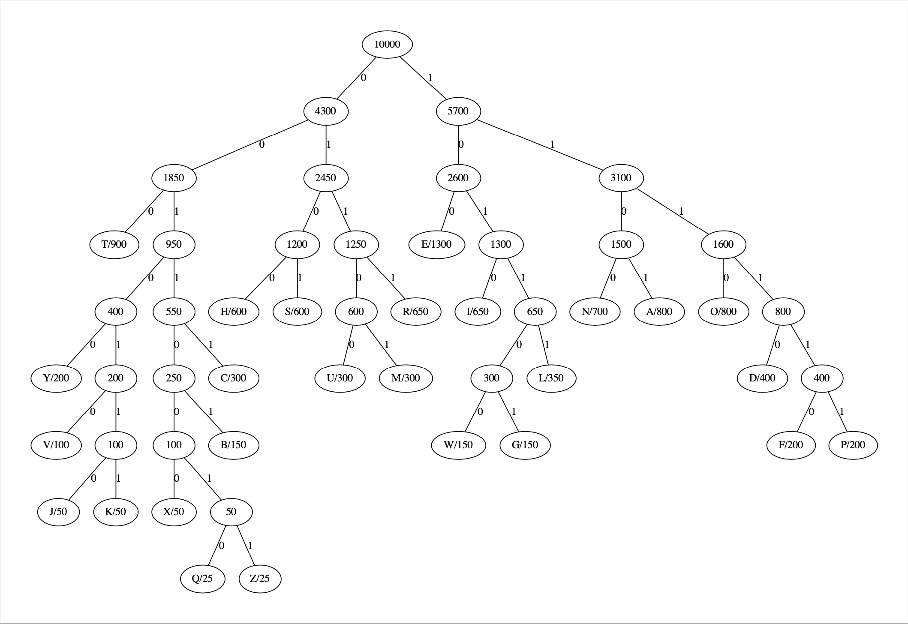


## Unit 3 Divide and Conquer
**A basic algorithm design technique**
### Divide
1. **Given some problem, divide it into a number of similar, but simpler problems.**
2. **Solve each of these problems recursively.**

### Conquer
1. **Combine the solutions of each of these subproblems into a solution of the original problem.**

### Example: Linear time selection
* **Input: n distinct numbers, and an integer k (where 1≤ k ≤n). **
* **Output: The kth largest of these n numbers.**

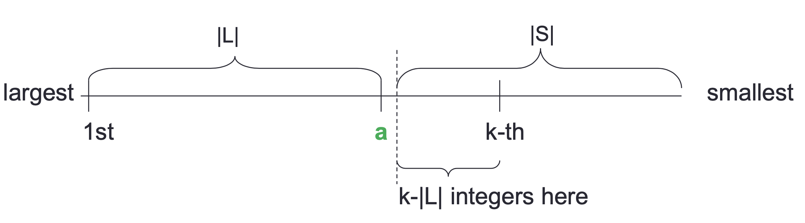
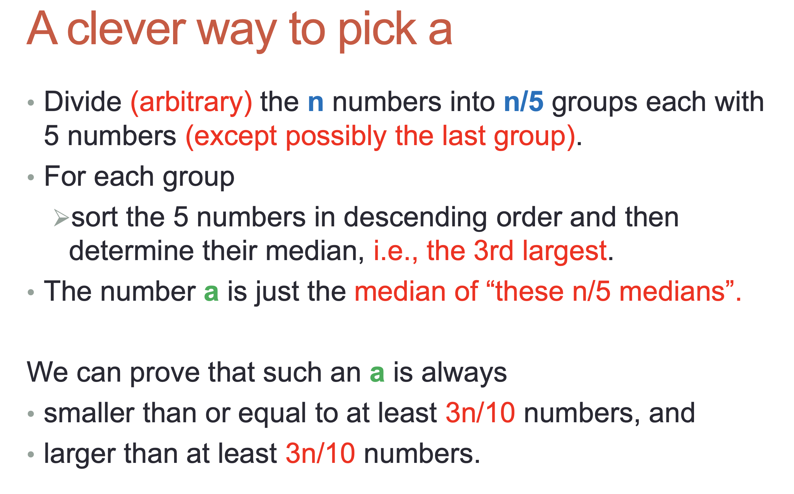
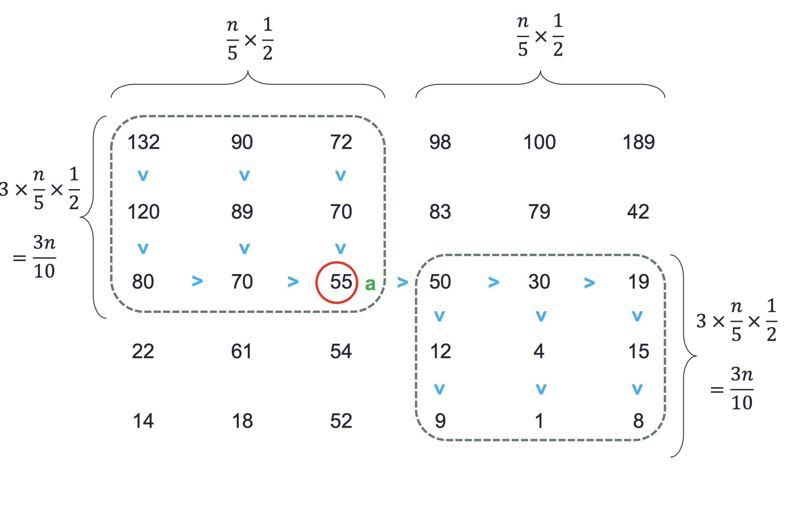

### The Code
```python
def sort5(L):
    "Sort a list L of 5 numbers in 7 comparisons"
    a, b, c, d, e = L
    if b < a:   a, b = b, a
    if d < c:   c, d = d, c
    if a < c:   a, b, c, d = c, d, a, b

    if e > a:
        if e > b:   pass
        else:       b, e = e, b
    else:
        if e < c:   c, a, b, e = e, c, a, b
        else:       a, b, e = e, a, b
    
    if d < b:
        if d < a:   return [c, d, a, b, e]
        else:       return [c, a, d, b, e]
    else:
        if d > e:   return [c, a, b, e, d]
        else:       return [c, a, b, d, e]

```

```python
import numpy as np
from sort5 import sort5

def largest(N, k):
    if len(N) < 5:
        a = sorted(N)[(len(N)-1)//2]
    else:
        n = len(N) - (len(N) % 5)
        medians = [sort5(N[i:i+5])[2] for i in range(0, n, 5)]
        a = largest(medians, len(medians)//2 + 1)

    L = [x for x in N if x > a]
    S = [x for x in N if x < a]

    len_L = len(L) + 1
    if len_L == k:
        return a
    elif len_L > k:
        return largest(L, k)
    else:
        return largest(S, k-len_L)

if __name__ == "__main__":
    N = np.random.permutation(50).tolist()
    print(largest(N, 10))
    
```

## Unit 4 Graph Algorithms
### Breadth-First Search (BFS)
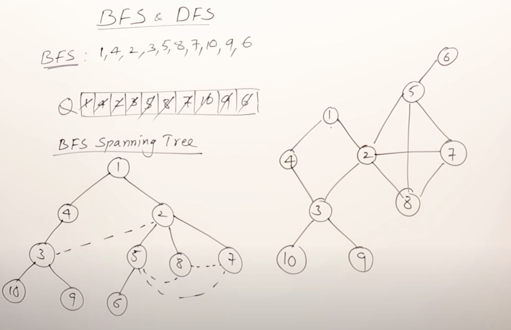

#### Example
**LeetCode Problem: [Word-ladder](https://leetcode.com/problems/word-ladder/)**


### Depth-First Search (DFS)
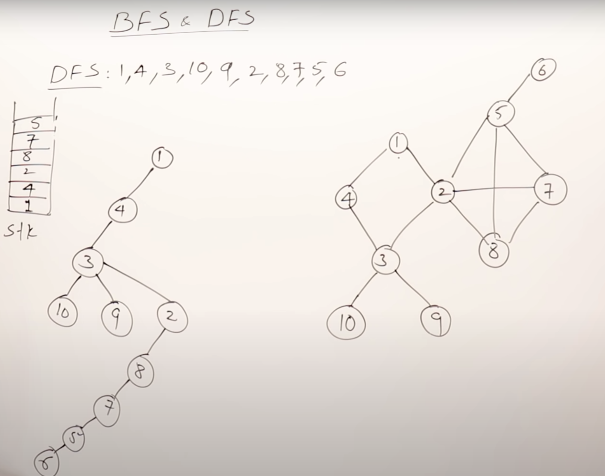
#### Example

